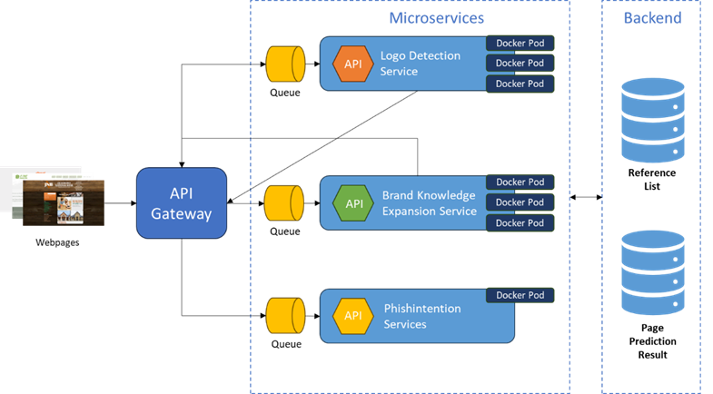

# Dynaphish + PhishIntention Microservice Architecture
## About
This repo is an improvement to the Dynphish application published by Liu Roufan (https://github.com/code-philia/Dynaphish). We transformed the single-threaded application - Dynaphish into a microservices-based architecture, allowing for imporved communication between components using RESTful APIS. As a result we see an improvement in
1) Runtime speed of each component
2) Number of webpages processed a day

## Architecture Diagram


## Description of Services

| Service | Description |
| --- | --- |
| Logo Detection Service | we use the website URL to first get it is domain and HTML title information. Then, the domain information is checked by a list of known forbidden words. Next, we process the webpage by extracting the logo information from using its screenshot.  |
| Brand Knowledge Expansion Service | we use logo information to predict the brand name. If the brand is unseen and popular, we will add it to the brand reference list.|
| PhishIntention Service | we compare the given logo information with our reference list to check if the website is imitating any brand. |

## Project Structure
```
|_catch_phishing_certstream: Certstream based webpage crawler
|_data: folders containing webpages screenshots
|_dynaphish-queue: api gateway that manages enqueue and dequeue for the services
  |_app: dynaphish queue flask server code
  |_docker-compose.yml: build dynaphish-queue server
|_field_study_logo2brand: 
  |_expand_targetlist: reference list of brands
  |_LOG: runtime logs
  |_configs.yaml: configuration file for the models
|_has_logo_api
  |_app: logo detection service server code
  |_loadbalancer: nginx configuration file
  |_docker-compose.yml build logo detection server
|_ke_api
  |_app: brand knowledge expansion service server code
  |_loadbalancer: nginx configuration file
  |_docker-compose.yml build brand knowledge expansion server
|_phishintention_api
  |_app: phishintention service server code
  |_loadbalancer: nginx configuration file
  |_docker-compose.yml build phishintention server
```

## Setup
Requirements
* Docker
* 32GB ram
* 8 core cpu

1) download and unzip https://drive.google.com/file/d/11UQODAIebx6HRvnd0JQkK4jPgs8MczUy/view?usp=sharing. Copy its content to field_study_logo2brand
2) Create a google cloud service account, set the billing details
    * Create a project, enable "Custom Search API", "Cloud Vision API"
    * For "Custom Search API", get the API Key and Search Engine ID following this guide.
    * Create a blank txt file in the directory "field_study_logo2brand/api_key.txt", copy and paste your API Key and Search Engine ID into the txt file like the following:
    ```
    [YOUR_API_KEY]
    [YOUR_SEARCH_ENGINE_ID]
    ```
    * For "Cloud Vision API", download the JSON key following this guide, save the JSON file under "field_study_logo2brand/discoverylabel.json"
3) your field_study_logo2brand folder should looks like
```
|_field_study_logo2brand
  |_LOGO_FEATS.npy
  |_LOGO_FILES.npy
  |_domain_map.pkl
  |_api_key.txt
  |_discoverylabel.json
  |_configs.yaml
  |_expand_targetlist
  |_LOG
  |_util
```
4) Setup MongoDB following https://www.mongodb.com/basics/clusters/mongodb-cluster-setup and create an API key for api access
    * create a .env file based on the database meta data. It should looks like
    ```
    COLLECTION=XXX
    DATABASE=XXX
    API_KEY=XXX
    ```
    * copy the .env file to
        * has_logo_api/app
        * phishintention_api/app
        * ke_api/app
        * catch_phishing_certstream/
5) look through all the docker-compose.yml files and replace any <LOCATION_ON_DRIVE> find with absolute path to this project. For example
```
volumes:
    - d:\dynaphish-microservice-architecture\field_study_logo2brand:/field_study_logo2brand
    - d:\dynaphish-microservice-architecture\data:/data
```
6) follow the ReadMe files in the folders below to setup the services in docker
    * dynaphish-queue/ReadMe.md
    * has_logo_api/ReadMe.md
    * phishintention_api/ReadMe.md
    * ke_api/ReadMe.md
    * catch_phishing_certstream/ReadMe.md
7) Start the services in sequence
    1) dynaphish queue
    2) logo detection service
    3) brand knowledge expansion service
    4) phishintetion service
    5) catch_phishing_certstream service
8) monitor the docker GUI to find any anomaly 

## Contacts
If you encounter any issues in code deployment, please reach us via Email or create an issue in the repository:
* liu.ruofan16@u.nus.edu
* dingmingray@gmail.com
